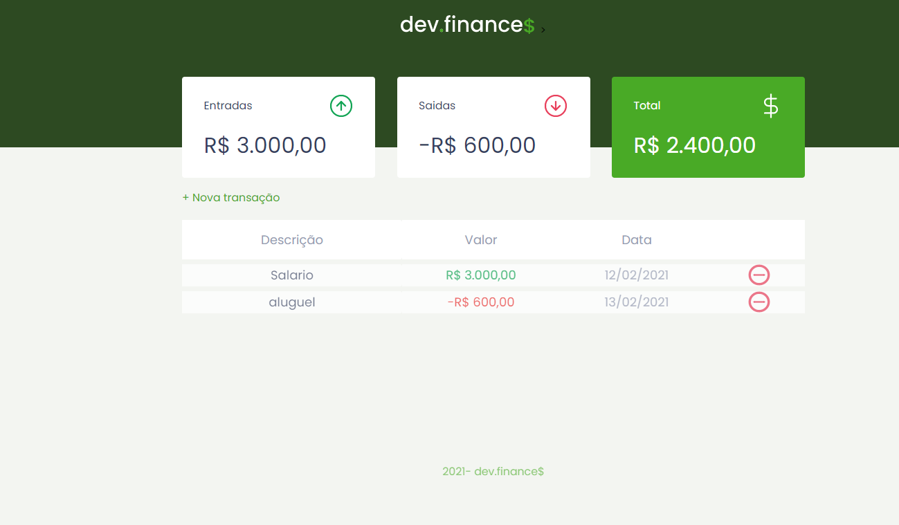

# maratona-discover

Maratona de Programação Web Ofertada pela Rockteseat, nesta maratona, o objetivo era construir uma aplicação
do zero, deste de CSS, HTML e JavaScript.
O final da Aplicação conforme a imagem a baixo.

          
                                       

                                       
### Adicionando modo Dark

Para melhorar o aprendizado, por conta propria decidi adicionar opção modo dark, pegando as variaves do css pelo JavaScript.

          
                                       

